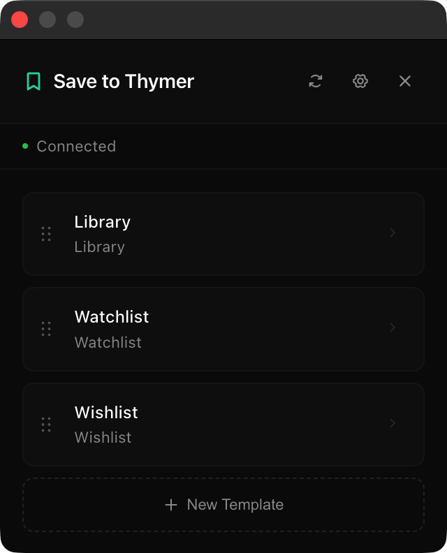

# Save to Thymer

A Chrome extension + Thymer plugin combo for saving web pages directly to Thymer collections. Allowing you to create custom templates and map page data to your collection properties.

**Version:** 1.0.0

## Features

- **Custom Templates** - Create reusable templates for different use cases (articles, reading list, bookmarks...)
- **Field Mapping** - Map page data (title, URL, description, images) to any collection property
- **Static Values** - Pre-fill fields with fixed values (e.g., Status = "To Read")
- **Page Clipping** - Extract and save the main content of articles as Markdown
- **Image Selector** - Choose from detected page images for the banner
- **Import/Export** - Backup and share your templates as JSON
- **Drag & Drop Reorder** — Organize your templates by priority

## Installation

### 1. Install the Chrome Extension

1.  Clone or download this repository.
2.  Open Chrome and navigate to `chrome://extensions/`.
3.  Enable **Developer mode** (toggle in the top right).
4.  Click **Load unpacked**.
5.  Select the `chrome-extension` folder from this repository.

### 2. Install the Thymer Plugin

1.  Open your [Thymer workspace](https://thymer.com).
2.  Open the Command Palette (`Cmd+P` on Mac, `Ctrl+P` on Windows).
3.  Search for and select **"Plugins"**.
4.  Click **"Create Plugin"** and choose to create a new **Global Plugin**.
5.  In the plugin editor:
    -   **Custom Code tab**: Copy and paste the contents of `thymer-plugin/plugin.js`.
    -   **Configuration tab**: Copy and paste the contents of `thymer-plugin/plugin.json`.
6.  Click **Save**.

## Usage

### Setting Up a Template

1.  Click the **Save to Thymer** extension icon.
2.  Click **+ New Template**.
3.  **Name**: Give your template a name.
4.  **Collection**: Select the Thymer collection you want to save to.
5.  **Mappings**: Configure how data should be saved.
    -   *Example:* Map "Page Title" to your collection's "Name" field.
    -   *Example:* Map "Page URL" to a "Link" field.
    -   *Example:* Set a "Status" choice field to "To Read" (Static Value).
6.  Click **Save**.

### Saving Content

1.  Navigate to any webpage you want to save.
2.  Click the extension icon.
3.  Select the template you created.
4.  Review the extracted data (Title, Image, etc.).
5.  Click **Save**. The data will appear instantly in Thymer.

### Connection Issues?

If the extension says "Not connected":
1.  Ensure you have a Thymer tab open.
2.  Click the **Reconnect** button in the extension's header.
3.  If that fails, refresh your Thymer tab.

## Contributing

Feel free to open issues or submit pull requests!

## License

MIT